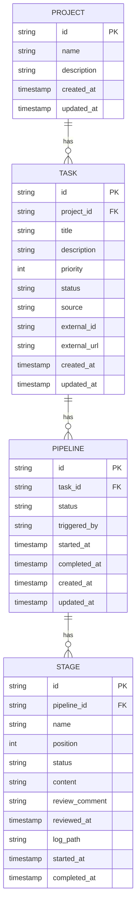

# Data Model

This document describes the logical data model for the AI Coding Factory hub. It is derived from the functional requirements and is independent of any specific storage technology.

---

## Entities

### Project

Represents a software project. Users select a project from the global header dropdown; all tasks are scoped to a project.

| Field | Type | Required | Description |
|---|---|---|---|
| `id` | string | yes | Unique identifier (`project_<timestamp>_<pid>`) |
| `name` | string | yes | Human-readable project name |
| `description` | string | no | Optional project description |
| `created_at` | ISO 8601 timestamp | yes | Creation time |
| `updated_at` | ISO 8601 timestamp | yes | Last modification time |

---

### Task

Represents a task belonging to a project. Tasks are prioritised within a project via an explicit ordering field (reflecting drag-and-drop reordering on the board).

| Field | Type | Required | Description |
|---|---|---|---|
| `id` | string | yes | Unique identifier (`task_<timestamp>_<pid>`) |
| `project_id` | string | yes | FK → Project |
| `title` | string | yes | Short task title shown in the board row |
| `description` | string | no | Full task description (Markdown) |
| `priority` | integer | yes | Ordinal position within the project (lower = higher priority) |
| `status` | TaskStatus | yes | Computed overall lifecycle status derived from pipelines (see enum) |
| `source` | SourceType | yes | How the task was created (see enum) |
| `external_id` | string | no | ID in the originating system (e.g., Jira issue key) |
| `external_url` | string | no | Direct URL to the task in the originating system |
| `created_at` | ISO 8601 timestamp | yes | Creation time |
| `updated_at` | ISO 8601 timestamp | yes | Last modification time |

#### TaskStatus enum

| Value | Meaning |
|---|---|
| `pending` | Task created; no pipeline has run yet |
| `in_progress` | At least one pipeline is actively running |
| `review` | At least one stage is awaiting human review |
| `done` | All required stages approved; task complete |
| `error` | A pipeline run failed without recovery |

#### SourceType enum

| Value | Meaning |
|---|---|
| `manual` | Created directly in the UI |
| `jira` | Imported via the Jira import endpoint |
| `github` | Imported from a GitHub issue (future) |

---

### Pipeline

Represents a single pipeline execution triggered for a task. A task can have many pipelines (e.g., re-runs after feedback). Each pipeline contains an ordered list of stages that are defined at runtime — the model imposes no fixed set of stage types.

| Field | Type | Required | Description |
|---|---|---|---|
| `id` | string | yes | Unique identifier (`<task_id>_pipeline_<timestamp>`) |
| `task_id` | string | yes | FK → Task |
| `status` | PipelineStatus | yes | Execution status (see enum) |
| `triggered_by` | string | no | User or system that triggered the run |
| `started_at` | ISO 8601 timestamp | yes | When the pipeline process started |
| `completed_at` | ISO 8601 timestamp | no | When the pipeline process ended |
| `created_at` | ISO 8601 timestamp | yes | Record creation time |
| `updated_at` | ISO 8601 timestamp | yes | Last modification time |

#### PipelineStatus enum

| Value | Meaning |
|---|---|
| `pending` | Queued, not yet started |
| `running` | Process is active |
| `completed` | All stages finished successfully |
| `failed` | One or more stages failed |
| `stopped` | Manually stopped by the user |

---

### Stage

Represents one step within a pipeline. Stages are ordered and generic — the `name` is a free-form string defined at pipeline creation time (e.g., `"planning"`, `"code-review"`, `"deploy"`). No fixed set of stage types is enforced by the model.

| Field | Type | Required | Description |
|---|---|---|---|
| `id` | string | yes | Unique identifier (`<pipeline_id>_stage_<position>`) |
| `pipeline_id` | string | yes | FK → Pipeline |
| `name` | string | yes | Free-form stage label (e.g., `"planning"`, `"implementation"`) |
| `position` | integer | yes | Ordinal position within the pipeline (0-based) |
| `status` | StageStatus | yes | Current stage status (see enum) |
| `content` | string | no | Stage artifact output (plan text, environment URL, PR reference, etc.) |
| `review_comment` | string | no | Human feedback submitted during review |
| `reviewed_at` | ISO 8601 timestamp | no | When the last review action was taken |
| `log_path` | string | no | Path to the captured log file on disk for this stage |
| `started_at` | ISO 8601 timestamp | no | When this stage began executing |
| `completed_at` | ISO 8601 timestamp | no | When this stage finished executing |

#### StageStatus enum

| Value | Displayed as | Meaning |
|---|---|---|
| `idle` | Grey chip | Stage not yet started |
| `in_progress` | Spinner | Stage is actively executing |
| `needs_review` | Review badge | Stage finished; awaiting human review |
| `approved` | Green / done | Human approved the stage output |
| `failed` | Red / error | Stage execution failed |
| `stopped` | Stopped | Stage was halted before completion |

---

## Relationships

```
Project  1 ──< Task  1 ──< Pipeline  1 ──< Stage
```

- One **Project** has many **Tasks**.
- One **Task** has many **Pipelines** (e.g., re-runs after feedback).
- One **Pipeline** has many **Stages** (ordered, generic steps defined at runtime).
- Each **Stage** belongs to exactly one **Pipeline**.

---

## Entity–Relationship Diagram



---

## Storage Notes

- Storage is file-backed: each **Project**, **Task**, and **Pipeline** is a separate JSON file under `$DATA_DIR/projects/`, `$DATA_DIR/tasks/`, and `$DATA_DIR/pipelines/` respectively.
- **Stages** are embedded as an ordered array inside the Pipeline JSON document — no separate file per stage.
- Log output for each Stage is written to a plain-text file on disk, referenced by the stage's `log_path`.
- All timestamps are stored as ISO 8601 strings (UTC).

---

## Example: Task JSON

```json
{
  "id": "task_1756200000000_42",
  "project_id": "project_1756100000000_42",
  "title": "User can log in with email and password",
  "description": "As a registered user I want to log in with my email and password so that I can access my account.",
  "priority": 1,
  "status": "review",
  "source": "manual",
  "external_id": null,
  "external_url": null,
  "created_at": "2026-02-24T09:00:00Z",
  "updated_at": "2026-02-24T10:05:00Z"
}
```

---

## Example: Pipeline JSON

```json
{
  "id": "task_1756200000000_42_pipeline_1756203600000",
  "task_id": "task_1756200000000_42",
  "status": "running",
  "triggered_by": "user",
  "started_at": "2026-02-24T10:00:00Z",
  "completed_at": null,
  "created_at": "2026-02-24T10:00:00Z",
  "updated_at": "2026-02-24T10:03:00Z",
  "stages": [
    {
      "id": "task_1756200000000_42_pipeline_1756203600000_stage_0",
      "pipeline_id": "task_1756200000000_42_pipeline_1756203600000",
      "name": "planning",
      "position": 0,
      "status": "approved",
      "content": "1. Add /auth/login endpoint\n2. Validate email + password\n3. Return JWT on success",
      "review_comment": "Looks good, proceed.",
      "reviewed_at": "2026-02-24T10:02:00Z",
      "log_path": "/tmp/ai-coding-factory/pipelines/task_1756200000000_42_pipeline_1756203600000_stage_0.log",
      "started_at": "2026-02-24T10:00:00Z",
      "completed_at": "2026-02-24T10:01:45Z"
    },
    {
      "id": "task_1756200000000_42_pipeline_1756203600000_stage_1",
      "pipeline_id": "task_1756200000000_42_pipeline_1756203600000",
      "name": "implementation",
      "position": 1,
      "status": "in_progress",
      "content": null,
      "review_comment": null,
      "reviewed_at": null,
      "log_path": "/tmp/ai-coding-factory/pipelines/task_1756200000000_42_pipeline_1756203600000_stage_1.log",
      "started_at": "2026-02-24T10:02:05Z",
      "completed_at": null
    }
  ]
}
```
